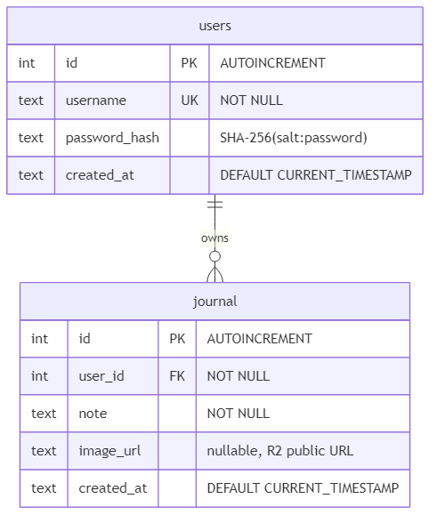
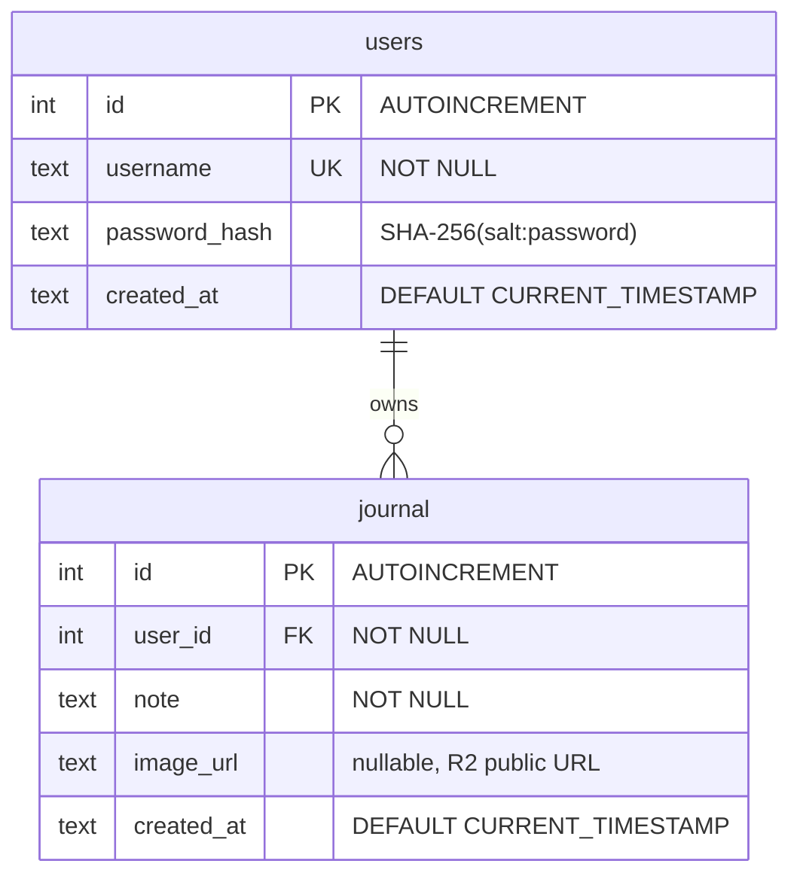
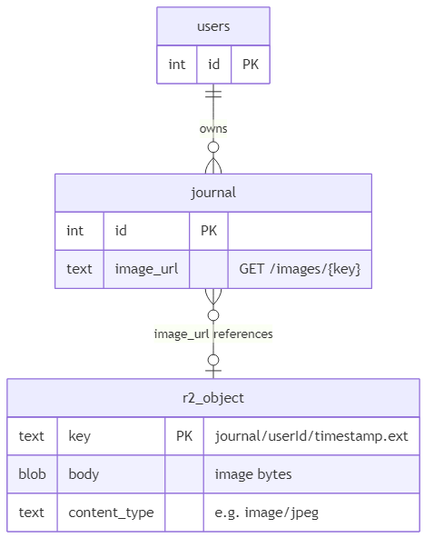
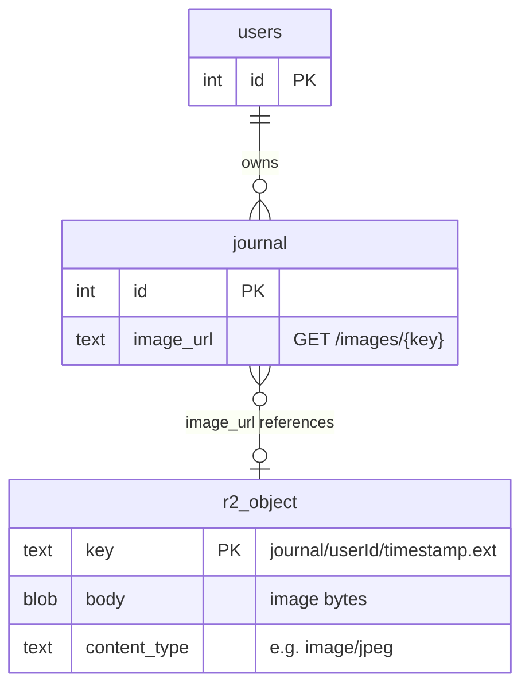
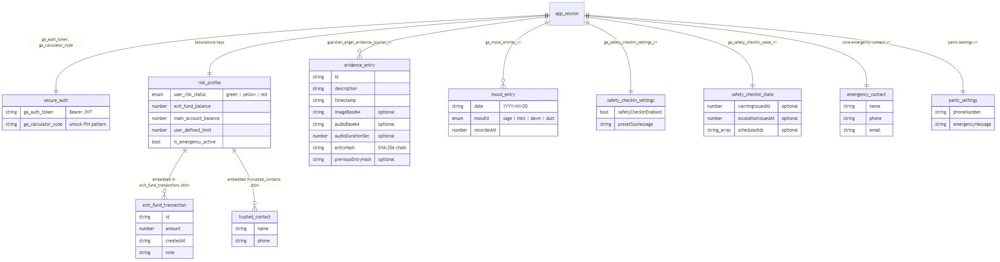
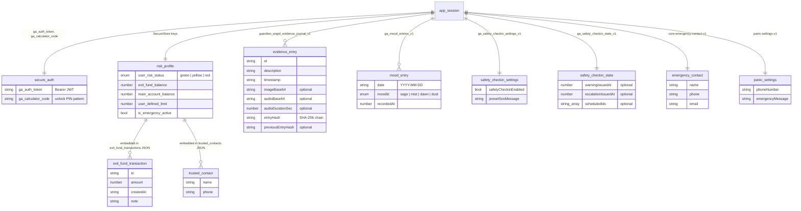
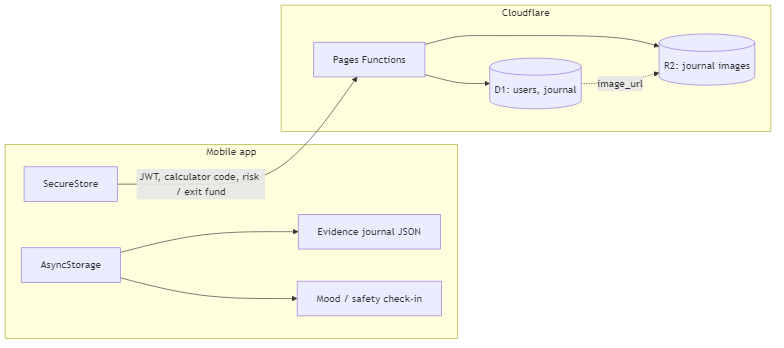
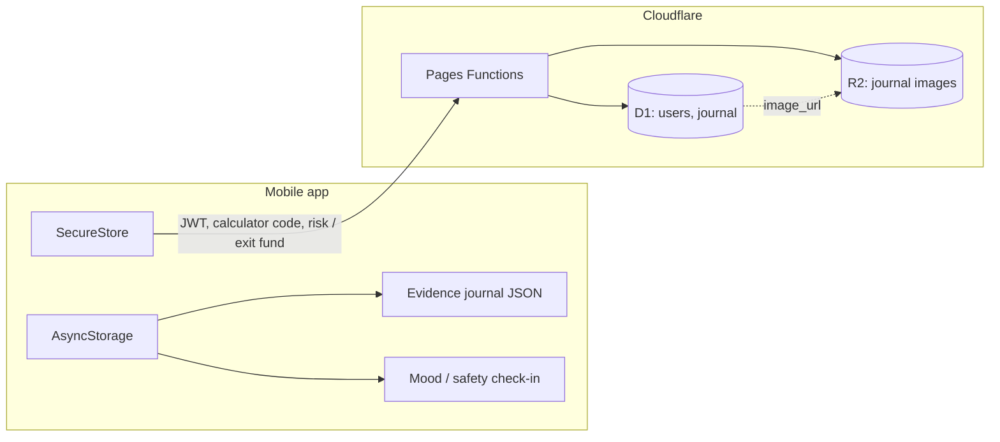

# Guardian Angel — Entity Relationship Diagram

> **Workshop / course submission:** For combined **ERD + Class Diagram** (entities, methods, DB mapping, UI layer), see **[WORKSHOP_DIAGRAMS.md](WORKSHOP_DIAGRAMS.md)**.

This document reflects the **implemented** data model: Cloudflare D1 (server), R2 (media), and on-device storage (client).

**PNG exports** (regenerate with `npm run docs:erd-png`):

| Diagram | PNG |
|---------|-----|
| D1 schema | [erd-d1.png](diagrams/erd-d1.png) |
| D1 + R2 | [erd-r2.png](diagrams/erd-r2.png) |
| On-device entities | [erd-on-device.png](diagrams/erd-on-device.png) |
| Cloud + client flow | [erd-e2e.png](diagrams/erd-e2e.png) |

Source `.mmd` files live in [`docs/diagrams/`](diagrams/).

---

## 1. Cloudflare D1 (relational)

Source: [`cloudflare/migrations/0001_init.sql`](../cloudflare/migrations/0001_init.sql)

Mermaid source

| Relationship | Cardinality | On delete |
|--------------|-------------|-----------|
| `users` → `journal` | One user, many journal rows | `CASCADE` (`user_id` → `users.id`) |

**Index:** `idx_journal_user_created` on `(user_id, created_at DESC)` for per-user timeline queries.

**Not stored in D1:** Calculator unlock code lives in the JWT session payload and client SecureStore (`ga_calculator_code`), not as a column on `users`.

---

## 2. Cloudflare R2 (object storage, logical link)

Bucket: `guardianangel-journal-images` (binding `JOURNAL_IMAGES`). Objects are keyed as `journal/{userId}/{timestamp}.{ext}`.

Mermaid source

Upload flow: authenticated `POST /api/images/upload` → `put` to R2 → response `url` may be persisted in `journal.image_url`.

---

## 3. On-device data (logical entities)

These are **not** normalized SQL tables; values are JSON blobs or key–value pairs in **Expo SecureStore** or **AsyncStorage** (web: `localStorage` for some keys).

Mermaid source

---

## 4. End-to-end view (cloud + client)

Mermaid source

**Note:** The in-app **evidence journal** (hash-chained entries) is stored locally. The D1 **`journal`** table is the server-side journal API path (text + optional `image_url`); both can coexist in the product roadmap.

---

## 5. Auth session (not a table)

JWT payload (`SessionPayload`) after login/register:

| Field | Type | Source |
|-------|------|--------|
| `userId` | number | `users.id` |
| `username` | string | `users.username` |
| `calculatorCode` | string | Same as login password at token issue time |
| `exp` | number | Unix expiry |

Verified with `AUTH_SECRET` (HMAC-SHA256); not persisted in D1.
