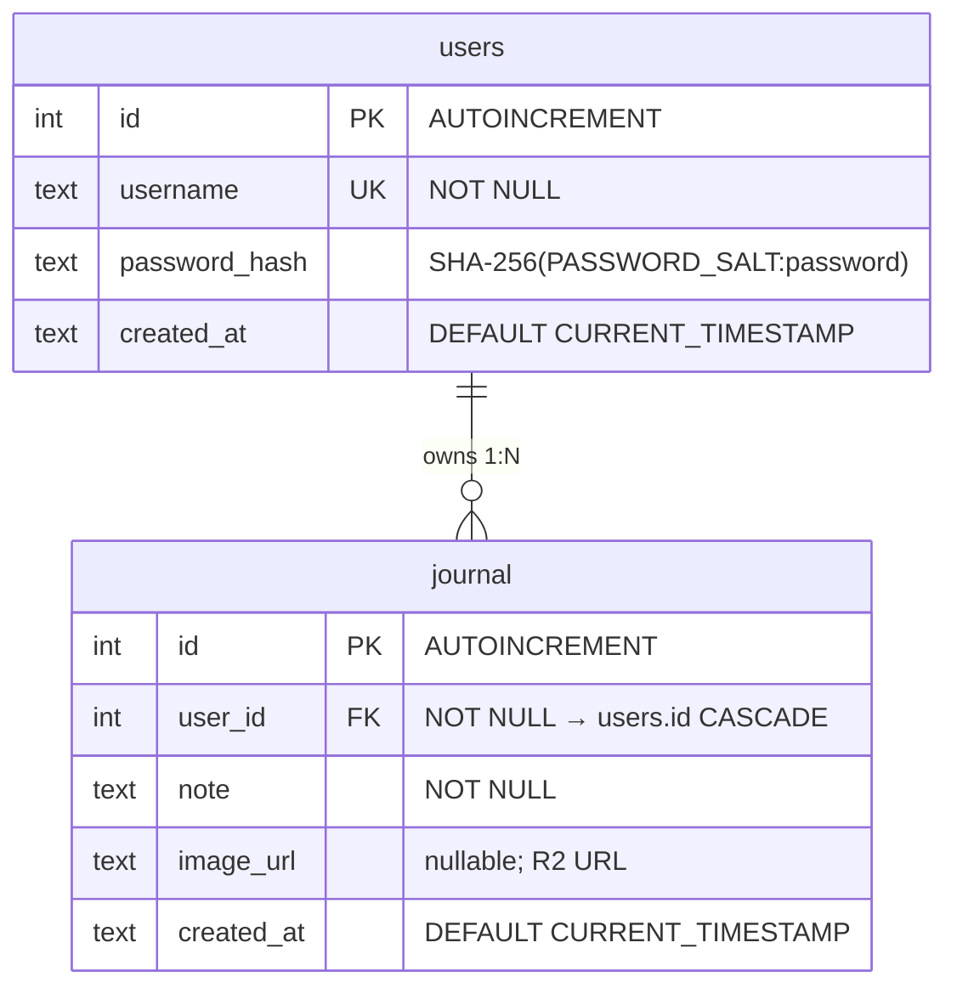
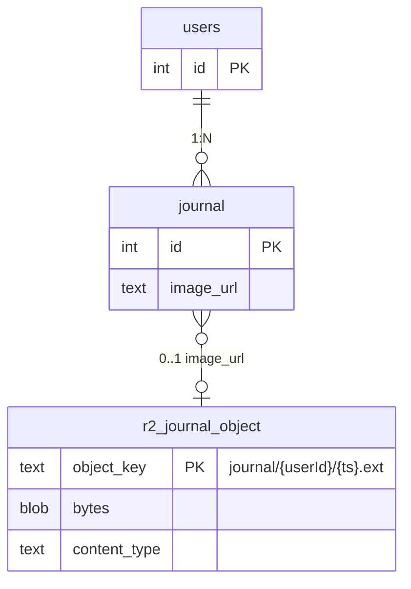
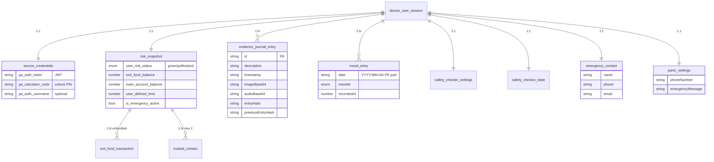
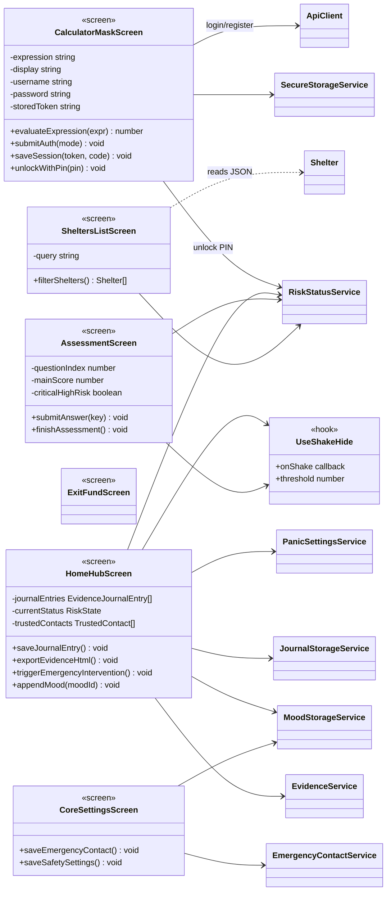
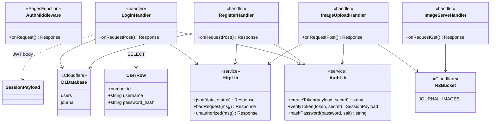
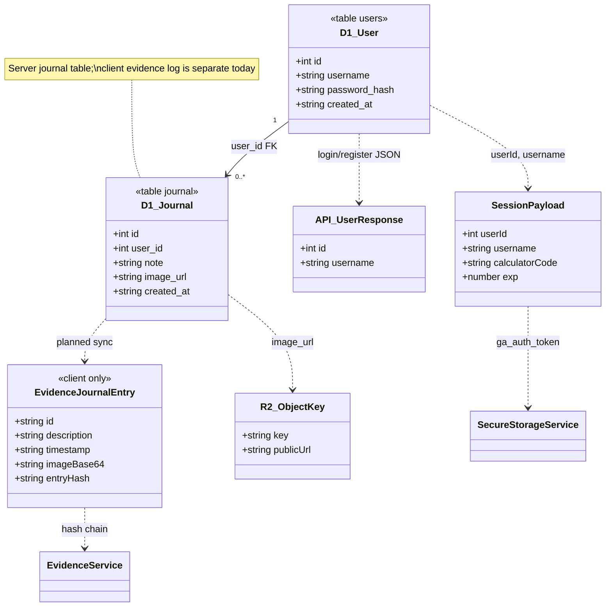
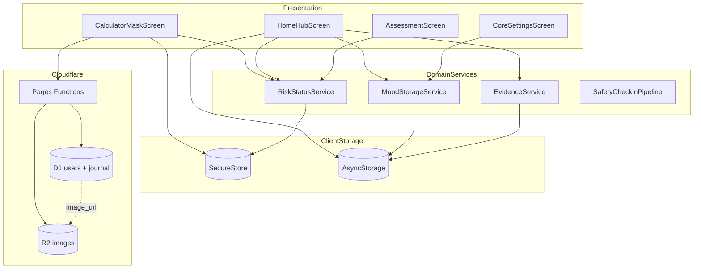

# Guardian Angel — Workshop Diagrams (ERD & Class Diagram)

**Project:** Stealth safety mobile app (React Native / Expo) + Cloudflare Pages Functions (D1, R2).

**Notation:** The codebase uses **TypeScript interfaces and functional modules** (no ES6 `class` declarations). Diagrams model exported **types as entities** and **modules as «service» / «screen» / «handler»** components — standard for documenting TypeScript/React systems.

**How to view:** Paste any fenced `mermaid` block into [Mermaid Live Editor](https://mermaid.live) or open this file in VS Code / GitHub.

**PNG exports:** [`docs/diagrams/workshop/`](diagrams/workshop/) — regenerate with `npm run docs:workshop-png` (also `npm run docs:erd-png` for the shorter ERD set).

---

## Part A — Entity Relationship Diagram (persistent data)

### A1. Cloudflare D1 (authoritative SQL)

Maps to: `cloudflare/migrations/0001_init.sql`, `functions/api/auth/*`.

| SQL table | Used by (runtime) | Maps to app type |
|-----------|-------------------|------------------|
| `users` | `POST /api/auth/login`, `POST /api/auth/register` | `UserRow` → API `{ id, username }`; credentials → `SessionPayload` (JWT, not a table) |
| `journal` | Schema ready; **no API writes yet** | Conceptual server journal; client uses `EvidenceJournalEntry[]` locally |

### A2. Cloudflare R2 (object storage, logical ER)

Maps to: `functions/api/images/upload.ts`, `functions/images/[[path]].ts`.

### A3. On-device persistence (logical ER)

Not SQL — JSON/key-value in **SecureStore** / **AsyncStorage** / web `localStorage`.

---

## Part B — Class Diagram (domain model)

Core **value types** and their relationships. Hash chain on evidence entries is maintained by `EvidenceService` (see Part C).

```mermaid
classDiagram
    direction TB

  class RiskState {
    <<enumeration>>
    green
    yellow
    red
  }

  class RiskProfile {
    +RiskState status
    +boolean emergencyActive
    +number exitFundBalance
    +number mainAccountBalance
    +number userDefinedLimit
    +ExitFundTransaction[] transactions
    +TrustedContact[] trustedContacts
  }

  class ExitFundTransaction {
    +string id
    +number amount
    +string createdAt
    +string note
  }

  class TrustedContact {
    +string name
    +string phone
  }

  class EvidenceJournalEntry {
    +string id
    +string description
    +string timestamp
    +string imageBase64
    +string audioBase64
    +number audioDurationSec
    +string entryHash
    +string previousEntryHash
  }

  class MoodEntry {
    +string date
    +MoodId moodId
    +number recordedAt
  }

  class MoodId {
    <<enumeration>>
    sage
    mist
    dawn
    dust
  }

  class SafetyCheckinSettings {
    +boolean safetyCheckinEnabled
    +string presetSosMessage
  }

  class SafetyCheckinState {
    +number warningIssuedAt
    +number escalationIssuedAt
    +string[] scheduledIds
  }

  class EmergencyContact {
    +string name
    +string phone
    +string email
  }

  class PanicSettings {
    +string phoneNumber
    +string emergencyMessage
  }

  class SessionPayload {
    +number userId
    +string username
    +string calculatorCode
    +number exp
  }

  class Shelter {
    +string id
    +string region
    +string city
    +string name
    +string phone
    +string type
  }

  class Question {
    +string id
    +QuestionCategory category
    +string textKey
  }

  class QuestionCategory {
    <<enumeration>>
    screening
    critical
  }

  RiskProfile "1" *-- "0..*" ExitFundTransaction : contains
  RiskProfile "1" *-- "0..2" TrustedContact : contains
  RiskProfile --> RiskState : status
  MoodEntry --> MoodId
  Question --> QuestionCategory
```

---

## Part C — Class Diagram (application services & persistence)

Functional modules modeled as **«service»** classes. Arrows show **dependency** (uses) and **composition** (owns in-memory state).

```mermaid
classDiagram
    direction TB

  class RiskStatusService {
    <<service>>
    -RiskState currentStatus
    -boolean isSecureSessionUnlocked
    -ExitFundSnapshot exitFundData
    +getCurrentStatus() RiskState
    +setCurrentStatus(next) void
    +statusFromScore(score) RiskState
    +resolveAssessmentStatus(score, critical) RiskState
    +hasSecureSessionAccess() boolean
    +getIsEmergencyActive() boolean
    +getExitFundData() ExitFundSnapshot
    +setExitFundData(next) void
    +getTrustedContacts() TrustedContact[]
    +addTrustedContact(c) void
    +unlockSecureDataWithPin(pin) boolean
    +hydrateSecureData() void
    +awaitSessionReady() Promise
    +stopEmergencyMode() void
  }

  class SecureStorageService {
    <<service>>
    +readSecureItem(key) string
    +writeSecureItem(key, value) void
    +deleteSecureItem(key) void
  }

  class JournalStorageService {
    <<service>>
    +readJournalRaw(key) string
    +writeJournalRaw(key, value) WriteResult
  }

  class EvidenceService {
    <<service>>
    +sha256Hex(input) string
    +computeEntryHash(entry, prev) string
    +chainHashes(entries) EvidenceJournalEntry[]
    +buildEvidenceHtml(entries, iso) string
  }

  class MoodStorageService {
    <<service>>
    +getMoodEntries() MoodEntry[]
    +saveMoodEntries(entries) void
    +appendTodayMood(moodId) MoodEntry[]
    +getSafetySettings() SafetyCheckinSettings
    +saveSafetySettings(s) void
    +getSafetyState() SafetyCheckinState
    +saveSafetyState(s) void
    +daysSinceLastMood(entries) number
  }

  class SafetyCheckinPipeline {
    <<service>>
    +runSafetyCheckinPipeline(t) void
    +disableSafetyCheckinSchedules() void
  }

  class NotificationService {
    <<service>>
    +configureNotificationHandler() void
    +ensureNotificationPermissions() boolean
    +scheduleQuietCheckInReminder(title, body) string[]
    +cancelStoredSchedules(ids) void
  }

  class EmergencyContactService {
    <<service>>
    +getEmergencyContact() EmergencyContact
    +saveEmergencyContact(c) void
  }

  class PanicSettingsService {
    <<service>>
    +getPanicSettings() PanicSettings
    +savePanicSettings(s) void
  }

  class ApiClient {
    <<service>>
    +apiFetch(path, init) Response
  }

  class JournalMediaService {
    <<service>>
    +pickJournalImageNative() PickedJournalImage
    +startNativeRecording() boolean
    +stopNativeRecording() CapturedAudio
  }

  class I18nService {
    <<service>>
    +setAppLanguage(lang) void
    +getSupportedLanguages() AppLanguage[]
  }

  RiskStatusService --> SecureStorageService : auth keys
  RiskStatusService ..> RiskProfile : manages
  EvidenceService ..> EvidenceJournalEntry : operates on
  JournalStorageService ..> EvidenceJournalEntry : serializes
  MoodStorageService ..> MoodEntry
  MoodStorageService ..> SafetyCheckinSettings
  MoodStorageService ..> SafetyCheckinState
  SafetyCheckinPipeline --> MoodStorageService
  SafetyCheckinPipeline --> RiskStatusService : trusted contacts
  SafetyCheckinPipeline --> NotificationService
  EmergencyContactService ..> EmergencyContact
  PanicSettingsService ..> PanicSettings
  ApiClient ..> SessionPayload : Bearer JWT
```

---

## Part D — Class Diagram (presentation / UI layer)

Screens are **React function components**; they depend on services and domain types.

---

## Part E — Class Diagram (server / Cloudflare API)

---

## Part F — Database ↔ application mapping

Shows how **D1 rows** relate to **client types** and where they diverge (dual journal model).

| D1 column | Application mapping |
|-----------|---------------------|
| `users.id` | `SessionPayload.userId`, API `user.id` |
| `users.username` | `SessionPayload.username`, login form |
| `users.password_hash` | Never sent to client; verified in `LoginHandler` |
| `journal.user_id` | Would map to `SessionPayload.userId` when API implemented |
| `journal.note` | Analogous to `EvidenceJournalEntry.description` |
| `journal.image_url` | Populated from `ImageUploadHandler` response URL (R2) |
| — | `EvidenceJournalEntry` stored under key `guardian_angel_evidence_journal_v1` via `JournalStorageService` |

---

## Part G — End-to-end architecture (workshop summary)

---

## Source file index (for grading)

| Layer | Primary paths |
|-------|----------------|
| Domain types | `app/risk-status.ts`, `src/evidence.ts`, `src/mood-checkin/types.ts`, `src/emergency-contact.ts`, `src/panic-settings.ts` |
| Services | `app/risk-status.ts`, `src/secure-storage.ts`, `src/journal-storage.ts`, `src/mood-checkin/*`, `src/evidence.ts`, `src/api.ts` |
| UI | `app/(tabs)/index.tsx`, `app/home.tsx`, `app/assessment.tsx`, `app/exit_fund.tsx`, `app/core-settings.tsx`, `src/screens/SheltersList.tsx` |
| API | `functions/api/auth/*`, `functions/api/images/upload.ts`, `functions/images/[[path]].ts`, `functions/_lib/*` |
| Database | `cloudflare/migrations/0001_init.sql` |
